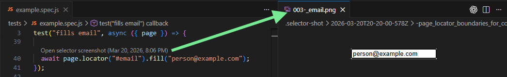

# selector-shot

Selector Shot helps teams see what their Playwright selectors are actually matching.

It captures focused screenshots from selector calls like `page.locator(...)` during test runs, writes capture metadata to `.selector-shot`, and the VS Code extension attaches that element visual back to the exact calling line with CodeLens.

That means QA and engineers can inspect selector results right where the code lives instead of bouncing between source, browser, and logs.



Selector Shot has two parts: the VS Code extension shows CodeLens, and the Playwright helper captures the selector metadata and screenshots those CodeLens use.

## This repo contains

- `packages/playwright-selector-shot`
  - npm package: `@getulionm/selector-shot-playwright`
  - records `page.locator(...)` callsite metadata
  - captures screenshots and writes `.selector-shot/**/*.json`
- `packages/vscode-extension`
  - VS Code extension package
  - reads `.selector-shot` metadata
  - shows `Open selector screenshot` CodeLens

## Client install and usage

In a client Playwright repo:

1. Install the extension from the VS Code Marketplace.
2. Open the app or package folder you want to work in.
3. Run command: `Selector Shot: Setup Project`.
4. Run capture mode:

```bash
npx selector-shot-update
```

If your test command is custom:

```bash
npx selector-shot-update npm run test:e2e
```

Extension-specific install details and commands are documented in:
- [packages/vscode-extension/README.md](/c:/Users/getul/Documents/Projects/selector-shot/packages/vscode-extension/README.md)

Workspace note: Selector Shot works best when VS Code is opened at the same app or package folder where `npx selector-shot-update` runs. In that common setup, the default `selectorShot.dataGlob` value of `.selector-shot/**/*.json` usually needs no changes.

## Roadmap

- Chain-aware locator captures: support locator-transforming chains so Selector Shot can safely attach visuals for `.first()`, `.last()`, `.nth()`, and then expand to `.filter()` plus chained `.locator()`. This work includes storing chain metadata instead of only the base selector and adding regressions to prove `first` and `nth` produce different captures.
- Accessibility selectors: add support for Playwright accessibility-first selectors such as `getByRole`, `getByLabel`, `getByText`, `getByTestId`, and related patterns.

## Develop in this repo

Install workspace deps:

```bash
npm install
```

Build extension bundle:

```bash
npm run build
```

Run Playwright package unit tests:

```bash
npm run test:unit
```

Run the full local verification set before a release:

```bash
npm run test:all
```

Marketplace launch guidance and the recommended compatibility matrix live in:
- [docs/marketplace-launch-checklist.md](/c:/Users/getul/Documents/Projects/selector-shot/docs/marketplace-launch-checklist.md)
